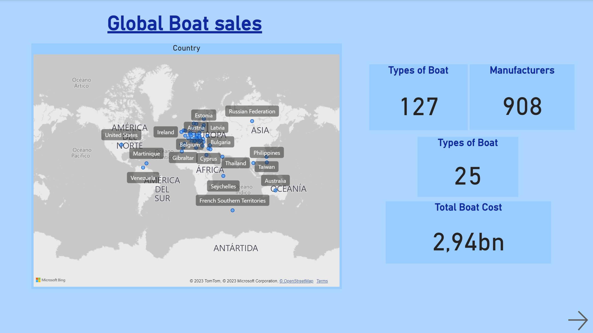
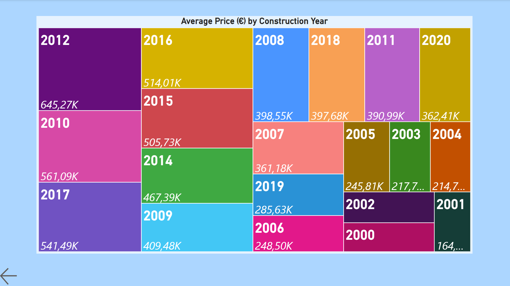

# Visualization Project - Boat Sales
Este repositorio incluye el trabajo llevado a cabo con el fin de mostrar las conclusiones que se pueden extraer de la base de datos de una página web de venta de barcos de primera y segunda mano.

## ETL - Extracción, transformación y carga de la BBDD

La base de datos ha sido descargda del siguiente [link](https://www.kaggle.com/datasets/karthikbhandary2/boat-sales/data).

En esta base de datos se incluyen las siguientes columnas:
* Price: precio de la embarcación en distintas monedas.
* Boat Type: Estilo de embarcación
* Manufacturer: Fabricante/astillero
* Type: Condición y tipo de propulsión
* Year Built: Año de fabricación
* Length: Eslora - largo del barco
* Width: Manga - ancho del barco
* Material: Material principal de fabricación
* Location: Lugar donde se encuentra el barco
* Number of Views: Valor entero con la cantidad de visitas del anuncio.

El primer paso tras descargar la información de tipo CSV es limpiar y preparar la información de cara a la visualización.

En la carpeta [notebooks](https://github.com/Jacobomb/VisualizationProject-Boat_Sales/tree/main/notebooks) se puede encontrar el [fichero](https://github.com/Jacobomb/VisualizationProject-Boat_Sales/blob/main/notebooks/1.CleaningData.ipynb) en Python donde se realiza la limpieza de la tabla. 

Los pasos han sido los siguientes:

* Columna `Price`: Dado que en esta columna venían juntos el precio de la embarcación y la moneda del país donde se encontraba el mismo, se ha procedido a separar la información en dos y después a calcular el precio en Euro por ser esta la moneda más común de la base de datos. Se anima a ver la carpeta [src](https://github.com/Jacobomb/VisualizationProject-Boat_Sales/tree/main/src) en la que se incluyen las funciones utilizadas para este paso.

* Para las columnas `Material` y `Manufacturer`, aquellas filas que no tuvieran un valor asignado han sido rellenadas con `unknown`. 

* La columna `Location` ha sido limpiada para separar en País y Ciudad. Se puede apreciar un patrón de separación y se explica en mayor detalle en el mencionado [fichero](https://github.com/Jacobomb/VisualizationProject-Boat_Sales/blob/main/notebooks/1).

Una vez la BBDD está lista, se guarda en [data](https://github.com/Jacobomb/VisualizationProject-Boat_Sales/tree/main/data) distinguiéndola de la BBDD original. 

Llegados a este punto se puede proceder con la visualización.

## Visualización

Para visualizar los insights extraidos del estudio se ha utilizado la herramienta Power BI. 

Para aquellos usuarios que dispongan de acceso, [aquí](https://app.powerbi.com/groups/me/reports/a79565ec-3dd7-4219-9099-cd4a31be35eb/ReportSectionb37d356e0c97e07a0a98?experience=power-bi) se encuentra la visualización llevada a cabo en la plataforma de *Microsoft*.

En caso de no contar con acceso, en la carpeta [visuals_captures](https://github.com/Jacobomb/VisualizationProject-Boat_Sales/tree/main/visuals_captures) se han incluido capturas de cada una de las pestañas del documento original. No son interactivas pero dan una idea el lector del contenido.

En primer lugar se muestra un *Overview* con infromación de la BBDD. Se incluye un mapa para mostrar la catnidad de países de los que se tienen anuncios de barcos.

En el resto de páginas del proyecto se puede dividir en dos partes. 

1) En primer lugar se estudia el gusto de los consumidores vía la variable `Visitas en los últimos 7 días`. Se utiliza esta variable como un indicador de gusto del potencial comprador. Para ello, se han graficado la media de visitas a los anuncios versus tipo de embarcación, propulsión y material de las partes estructurales del barco. 

Entre otras conclusiones, se sacan las siguintes:

* `Actividad`: Los barcos dedicados a actividades de ocio en el agua son sin duda las que más busquedas concentran. Con mucha diferencia, son los barcos dedicados a deportes acuáticos los que más se codician, siguiendo a actividades como la pesca.

* `Propulsión`: En el caso de la propulsión, los barcos de motor causan mucho mayor interés que los barcos veleros, y en la mayor parte de los casos los clientes buscan barcos de segunda mano. Esto se debe a que la mayor parte de la base de datos está conformada por barcos usados y a que cuando un cliente busca un barco nuevo, suele dirigirse directamente a la página web del fabricante para una información más cuidada y detallada.

* `Material` y `precio`: En cuanto al material del casco y otras partes estructurales, los plásticos copan gran parte del interés del comprador, le siguen la fibra de carbono, la madera y la fibra de vidrio. En cuanto al precio, se aprecia que la distribución no es exactamente igual. EL aluminio y la fibra de carbono tienen un precio muy superior al resto. Se entiende que los plásticos sean los materiales de elección dado su bajo precio medio.

2) En segundo lugar se estudia el precio medio por fabricante y año de fabricación.

* En la página 4 del proyecto se pueden ver los fabricantes y precios medios de sus barcos según el mercado. Se puede escoger el país en estudio y comprobar en que valores fluctuan los precios.

* Finalmente, se proyecta sobre un *treemap* los precios medios de los años de fabricación más caros. Salvo alguna excepción, no sorprende ver que los barcos más modernos tienen un coste mayor.

## Trabajos futuros

De cara a trabajos futuros, el autor cree pertinenete hacer un estudio más a fondo de las dimensiones de los barcos y la relación que estas pueden tener con los materiales de fabricación.

También se tiene intención de, ampliando la base de datos, averiguar como se traducen las visitas en compras reales. Se cree que pese a ser una variable interesante y útil, el número de visitas no siempre nos indica clientes realmente interesados o dispuestos a desembolsar una cantidad de capital tan importante.

## Herramientas y fuentes utilizadas

* [Pandas](https://pandas.pydata.org/docs/)
* [Kaggle](https://www.kaggle.com/datasets/karthikbhandary2/boat-sales/data)
* [PowerBI](https://powerbi.microsoft.com/es-es/)

